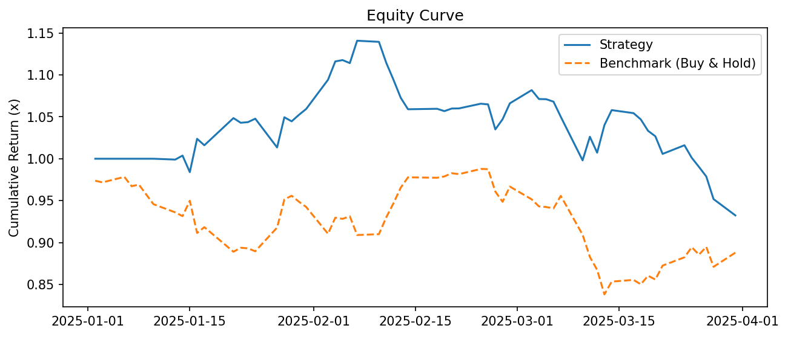
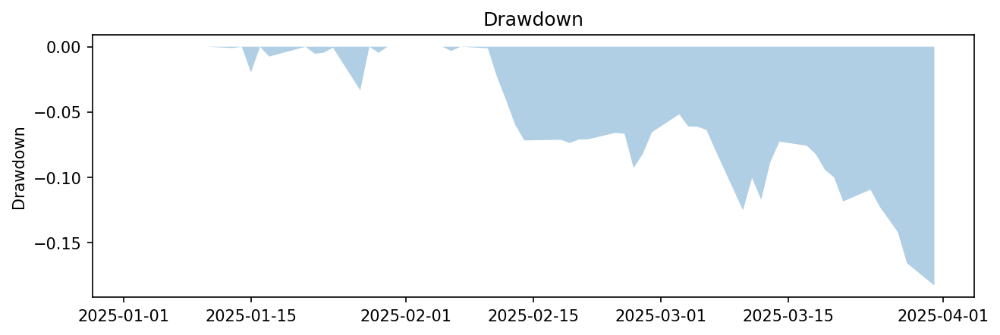
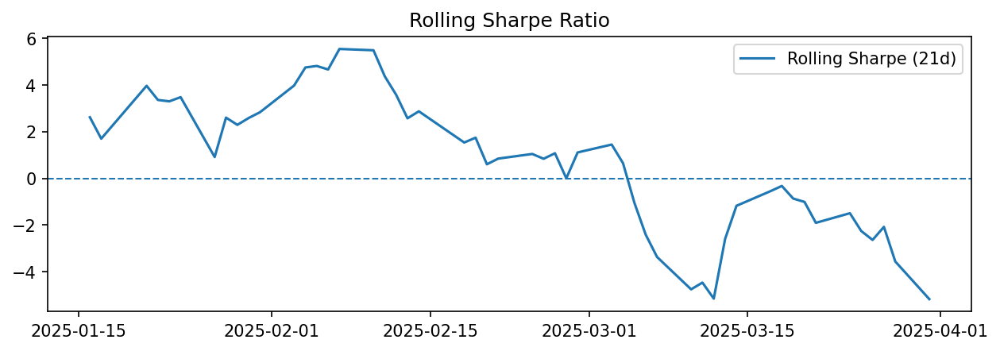

# 📈 Social Sentiment Trader

A Python-based **quant trading backtester** that integrates **financial news sentiment** with **price data** to generate trading signals and evaluate performance.  

This project is designed to showcase practical skills in **quantitative finance**, **data analysis**, and **algorithmic trading strategy design**.

---

## 🚀 Features
- **Data Loading**
  - Historical price data via [Yahoo Finance](https://pypi.org/project/yfinance/)
  - News data from CSV (real or AI-generated headlines for testing)

- **Sentiment Scoring**
  - Uses [VADER Sentiment](https://github.com/cjhutto/vaderSentiment) or pre-computed sentiment scores
  - Aggregates and smooths sentiment to daily signals
  - Options for z-score or absolute threshold signal generation
  - Automatic **t+1 lag** to avoid lookahead bias

- **Backtester**
  - Stateful position management (`BUY`, `SELL`, `HOLD`)
  - Stop-loss / take-profit exits
  - Transaction cost & slippage handling
  - Optional volatility targeting & leverage
  - Walk-forward (train/test) evaluation
  - Trade log CSV export

- **Performance Metrics**
  - CAGR, Sharpe, Sortino, Calmar ratios
  - Max drawdown
  - Hit ratio, turnover
  - Alpha & Information Ratio vs benchmark

- **Visualisations**
  - Equity curve (vs benchmark)
  - Drawdown chart
  - Rolling Sharpe ratio

---

## 📂 Project Structure
```
social-sentiment-trader2/
│
├── data_loader.py # Load price data from Yahoo Finance
├── sentiment_scorer.py # Convert news into sentiment scores & trading signals
├── backtester.py # Stateful trading backtester with PnL, risk exits
├── metrics.py # Performance metrics (CAGR, Sharpe, etc.)
├── main.py # CLI entry point: run pipeline (data → signals → backtest → plots)
│
├── data/ # Example input data
│ └── example_news.csv
│
├── results/ # Auto-saved outputs (trades, plots, metrics)
│ ├── aapl_trades.csv
│ ├── equity.png
│ ├── drawdown.png
│ └── rolling_sharpe.png
│
├── requirements.txt # Python dependencies
└── README.md # Project documentation (this file)
```
---

## ⚡ Quick Start

1. **Clone this repository**
   ```bash
   git clone https://github.com/IsabellaBrander28/social-sentiment-trader2.git
   cd social-sentiment-trader2
   ```

2. **Install dependencies**
   ```bash
   pip install -r requirements.txt
   ```

3. **Run the backtest**
   ```bash
   python main.py --ticker AAPL --period 1y --interval 1d --news_csv data/example_news.csv
   ```

## ⚙️ Configuration

You can control the experiment with command-line arguments (all optional):

| Argument     | Default               | Description                             |
|--------------|-----------------------|-----------------------------------------|
| --ticker     | "AAPL"                | Stock ticker to fetch (Yahoo Finance)   |
| --period     | "1y"                  | Price history period                    |
| --interval   | "1d"                  | Data frequency (1d, 1h, etc.)           |
| --news_csv   | data/example_news.csv | Path to news dataset                    |
| --split_date | None                  | Train/test split date (e.g. 2025-06-01) |

## 📊 Example Output
After running main.py, you’ll get:

- Trades CSV → results/aapl_trades.csv

- Performance metrics → printed in console + results/metrics_aapl.csv

- Plots:

  - 
  - 
  - 


## 🔧 Use Cases
- Academic / internship projects in quant finance

- Exploring sentiment-driven trading strategies

- Learning backtesting frameworks & performance analytics

- Extending with new signals, models, or data sources

## 📜 License
This project is released under the MIT License.
You’re free to use, modify, and distribute with attribution.

## 👩‍💻 Author
Built by Isabella Brander
📧 Email: isabellambrander@gmail.com
💼 LinkedIn: www.linkedin.com/in/isabellabrander
🐙 GitHub: https://github.com/IsabellaBrander28


